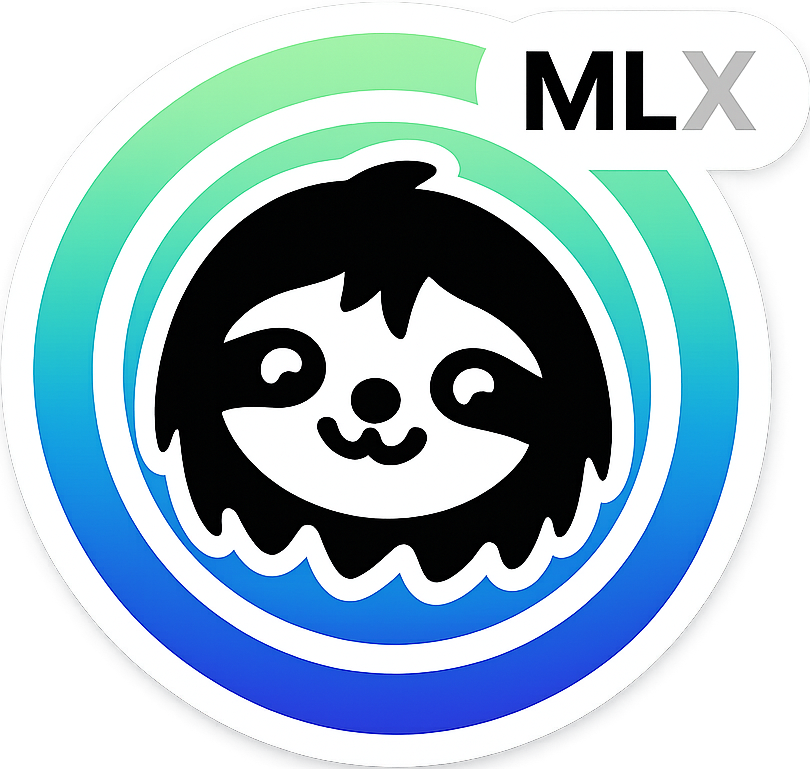

<p align="center">
  
</p>
<h1 align="center">Unsloth-MLX</h1>

<p align="center">
  <strong>Fine-tune LLMs on your Mac with Apple Silicon</strong><br>
  <em>Prototype locally, scale to cloud. Same code, just change the import.</em>
</p>

<p align="center">
  <a href="#installation"></a>
  <a href="#requirements"></a>
  <a href="https://github.com/ml-explore/mlx"></a>
  <a href="#license"></a>
</p>

<p align="center">
  <a href="#quick-start">Quick Start</a> ·
  <a href="#supported-training-methods">Training Methods</a> ·
  <a href="#examples">Examples</a> ·
  <a href="#project-status">Status</a>
</p>

---

## Why Unsloth-MLX?

Bringing the [Unsloth](https://github.com/unslothai/unsloth) experience to Mac users via Apple's [MLX](https://github.com/ml-explore/mlx) framework.

- 🚀 **Fine-tune LLMs locally** on your Mac (M1/M2/M3/M4/M5)
- 💾 **Leverage unified memory** (up to 512GB on Mac Studio)
- 🔄 **Same API as Unsloth** - your existing code just works!
- 📦 **Export anywhere** - HuggingFace format, GGUF for Ollama/llama.cpp

```python
# Unsloth (CUDA)                        # Unsloth-MLX (Apple Silicon)
from unsloth import FastLanguageModel   from unsloth_mlx import FastLanguageModel
from trl import SFTTrainer              from unsloth_mlx import SFTTrainer

# Rest of your code stays exactly the same!
```

## What This Is (and Isn't)

**This is NOT** a replacement for Unsloth or an attempt to compete with it. Unsloth is incredible - it's the gold standard for efficient LLM fine-tuning on CUDA.

**This IS** a bridge for Mac users who want to:
- 🧪 **Prototype locally** - Experiment with fine-tuning before committing to cloud GPU costs
- 📚 **Learn & iterate** - Develop your training pipeline with fast local feedback loops
- 🔄 **Then scale up** - Move to cloud NVIDIA GPUs + original Unsloth for production training

```
Local Mac (Unsloth-MLX)     →     Cloud GPU (Unsloth)
   Prototype & experiment          Full-scale training
   Small datasets                  Large datasets
   Quick iterations                Production runs
```

## Project Status

> 🚀 **v0.3.0** - Native training with proper RL losses!

| Feature | Status | Notes |
|---------|--------|-------|
| SFT Training | ✅ Stable | Native MLX training |
| Model Loading | ✅ Stable | Any HuggingFace model |
| Save/Export | ✅ Stable | HF format, GGUF |
| DPO Training | ✅ Stable | **Full DPO loss** |
| ORPO Training | ✅ Stable | **Full ORPO loss** |
| GRPO Training | ✅ Stable | **Multi-generation + reward** |
| KTO/SimPO | ✅ Stable | Proper loss implementations |
| Vision Models | ⚠️ Beta | Via mlx-vlm |
| **GUI Interface** | ✅ New | Gradio-based web UI |
| PyPI Package | 🔜 Soon | Install from source for now |

## Installation

```bash
# From source (recommended for now)
git clone https://github.com/dax8it/unsloth-mlx.git
cd unsloth-mlx

# Create & activate a virtual environment (Python 3.12 recommended)
python3.12 -m venv .venv
source .venv/bin/activate

# Using uv (recommended - faster and more reliable)
uv pip install -e .

# Or using pip
pip install -e .

# PyPI coming soon!
# uv pip install unsloth-mlx
```

## Quick Start

### 🎯 With GUI (Easiest)

Want to fine-tune without writing code? Use our Gradio-based GUI!

```bash
# Install GUI dependencies
pip install -e .

# Launch the GUI
python gui.py

# Open http://127.0.0.1:7860 in your browser
```

The GUI provides tabs for:
- Loading models from HuggingFace
- Chatting with models
- Configuring LoRA adapters
- SFT and RL training
- Exporting models

See [GUI_README.md](GUI_README.md) for detailed instructions.

**Export notes:**
- **Browse…** buttons are available in the Export tab to pick output locations without typing paths.
- **Save LoRA Adapters** exports a small folder containing `adapters.safetensors` + `adapter_config.json`.
- **Save Merged Model** produces a fused MLX model folder suitable for tools like LM Studio (MLX backend).
- **GGUF export** is only supported by `mlx_lm` for model families: `llama`, `mistral`, `mixtral`. Some model types (e.g. `lfm2`) cannot be exported to GGUF via `mlx_lm`.

### 💻 With Code

```python
from unsloth_mlx import FastLanguageModel, SFTTrainer, SFTConfig
from datasets import load_dataset

# Load any HuggingFace model (1B model for quick start)
model, tokenizer = FastLanguageModel.from_pretrained(
    model_name="mlx-community/Llama-3.2-1B-Instruct-4bit",
    max_seq_length=2048,
    load_in_4bit=True,
)

# Add LoRA adapters
model = FastLanguageModel.get_peft_model(
    model,
    r=16,
    target_modules=["q_proj", "k_proj", "v_proj", "o_proj"],
    lora_alpha=16,
)

# Load a dataset (or create your own)
dataset = load_dataset("yahma/alpaca-cleaned", split="train[:100]")

# Train with SFTTrainer (same API as TRL!)
trainer = SFTTrainer(
    model=model,
    train_dataset=dataset,
    tokenizer=tokenizer,
    args=SFTConfig(
        output_dir="outputs",
        per_device_train_batch_size=2,
        learning_rate=2e-4,
        max_steps=50,
    ),
)
trainer.train()

# Save (same API as Unsloth!)
model.save_pretrained("lora_model")  # Adapters only
model.save_pretrained_merged("merged", tokenizer)  # Full model
model.save_pretrained_gguf("model", tokenizer, quantization_method="q4_k_m")  # GGUF
```

## Supported Training Methods

| Method | Trainer | Implementation | Use Case |
|--------|---------|----------------|----------|
| **SFT** | `SFTTrainer` | ✅ Native MLX | Instruction fine-tuning |
| **DPO** | `DPOTrainer` | ✅ Native MLX | Preference learning (proper log-prob loss) |
| **ORPO** | `ORPOTrainer` | ✅ Native MLX | Combined SFT + odds ratio preference |
| **GRPO** | `GRPOTrainer` | ✅ Native MLX | Reasoning with multi-generation (DeepSeek R1 style) |
| **KTO** | `KTOTrainer` | ✅ Native MLX | Kahneman-Tversky optimization |
| **SimPO** | `SimPOTrainer` | ✅ Native MLX | Simple preference optimization |
| **VLM** | `VLMSFTTrainer` | ⚠️ Beta | Vision-Language models |

## Examples

Check [`examples/`](examples/) for working code:
- Basic model loading and inference
- Complete SFT fine-tuning pipeline
- RL training methods (DPO, GRPO, ORPO)

## Requirements

- **Hardware**: Apple Silicon Mac (M1/M2/M3/M4/M5)
- **OS**: macOS 13.0+ (15.0+ recommended for large models)
- **Memory**: 16GB+ unified RAM (32GB+ for 7B+ models)
- **Python**: 3.9+ (3.12 recommended)

## Comparison with Unsloth

| Feature | Unsloth (CUDA) | Unsloth-MLX |
|---------|----------------|-------------|
| Platform | NVIDIA GPUs | Apple Silicon |
| Backend | Triton Kernels | MLX Framework |
| Memory | VRAM (limited) | Unified (up to 512GB) |
| API | Original | 100% Compatible |
| Best For | Production training | Local dev, large models |

## Contributing

Contributions welcome! Areas that need help:
- Custom MLX kernels for even faster training
- More comprehensive test coverage
- Documentation and examples
- Testing on different M-series chips (M1, M2, M3, M4, M5)
- VLM training improvements

## License

Apache 2.0 - See [LICENSE](LICENSE) file.

## Acknowledgments

- [Unsloth](https://github.com/unslothai/unsloth) - The original, incredible CUDA library
- [MLX](https://github.com/ml-explore/mlx) - Apple's ML framework
- [MLX-LM](https://github.com/ml-explore/mlx-lm) - LLM utilities for MLX
- [MLX-VLM](https://github.com/Blaizzy/mlx-vlm) - Vision model support

---

<p align="center">
  <strong>Community project, not affiliated with Unsloth AI or Apple.</strong><br>
  ⭐ Star this repo if you find it useful!
</p>
